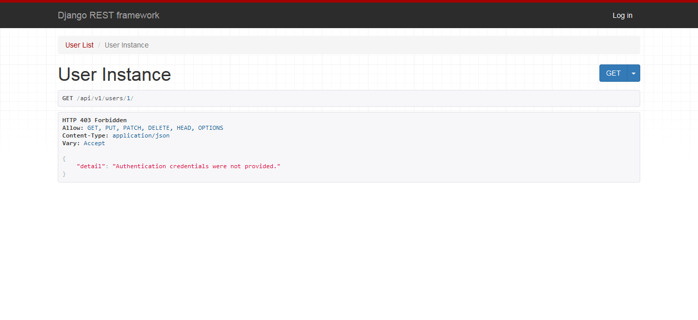
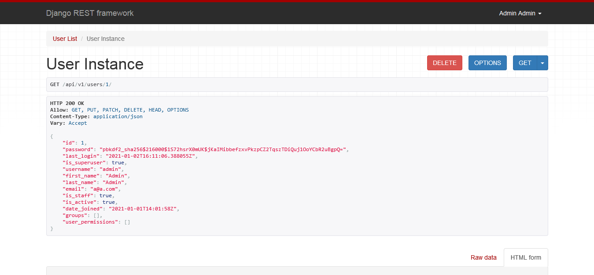

# Online store

A simple API model for design and implementation of store products. 

The code is in Python and JavaScript.

* User API interface without credentials                            
  

* User API interface with credentials                            
  

 
### List of most important tools used in this project are :

* PostgreSQL database for data storage.

* Django admin interface for CRUD data management.

* Django REST framwork for API management.

* Django-cors-headers application for handling the server headers required for Cross-Origin Resource Sharing (CORS).

* A simple React app for handling frontend.
 

### App features:

* __PostgreSQL DB:__ The app is implemented, using postgresql DB ([postgresql setup snippets](https://github.com/sshmo/Snippets/blob/master/postgresql.md)).

* __Admin Interface:__ Products could be added and deleted in admin interface.

* __API Interface:__ Products are available via API interface.
